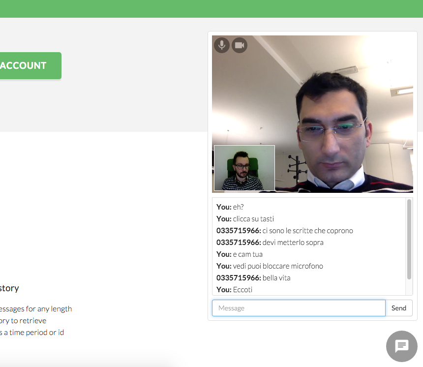

<p align="center" >
  
</p>

<br>

This JavaScript widget allows you easily use [Xserv](http://mobile-italia.com/xserv/) WebSocket API for text and video/audio messaging on your site.<br>
[Xserv](http://mobile-italia.com/xserv/) is a platform of real-time bi-directional messaging via WebSockets to web and mobile apps, or any other Internet connected device.

## How To Get Started

- [Download xserv-chat-widget](https://github.com/xserv/xserv-chat-widget/archive/master.zip) and try out the included JavaScript example apps.

##Installation

### Include dependecies

```html
<link rel="stylesheet" type="text/css" href="assets/css/bootstrap.min.css">
<link rel="stylesheet" type="text/css" href="assets/css/widget.css">

<script src="https://code.jquery.com/jquery-2.1.4.min.js"></script>
<script src="assets/js/bootstrap.min.js"></script>
<script src="https://mobile-italia.com/xserv/xserv.min.js"></script>
<script src="assets/js/widget.js"></script>
```

### Init widget with you app_id, a topic

```html
<script>
  $().ready(function() {
    var widget = new XservChatWidget("my_app_id", "my_topic", "widget", "widget-toggle");
	});
</script>
...

<div id="widget"></div>
<div id="widget-toggle"><div class="img"></div></div>
```

##Screnshot

An example of use on our site



## Credits

Xserv is owned and maintained by the [mobile-italia.com] (http://mobile-italia.com).

### Security Disclosure

If you believe you have identified a security vulnerability with Xserv, you should report it as soon as possible via email to xserv.dev@gmail.com. Please do not post it to a public issue tracker.

## License

Xserv is released under the GNU General Public License Version 3. See LICENSE for details.
